# Technologies
* MVVM Architecture
* Navigation Component
* Room
* Retrofit
* RxJava
* Koin
* Google Map

# API
https://github.com/SaharNajmi/MyHomeAPI

## Screenshots

  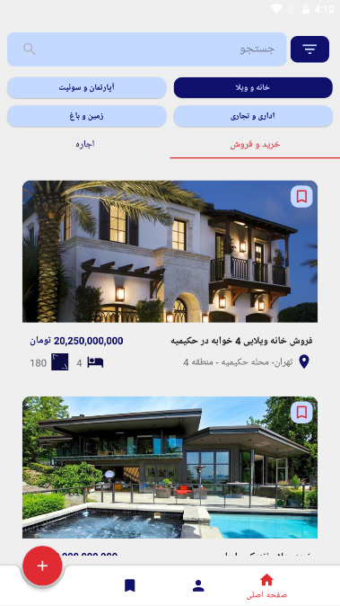
  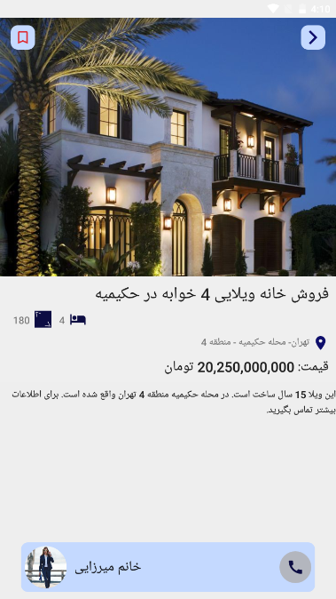
  

  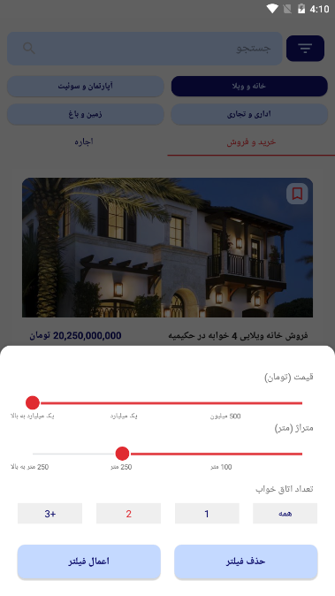
  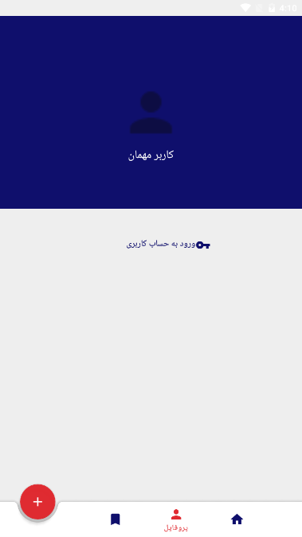
  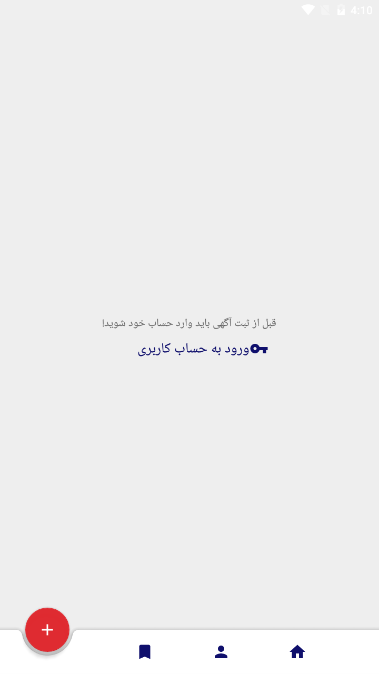

  
  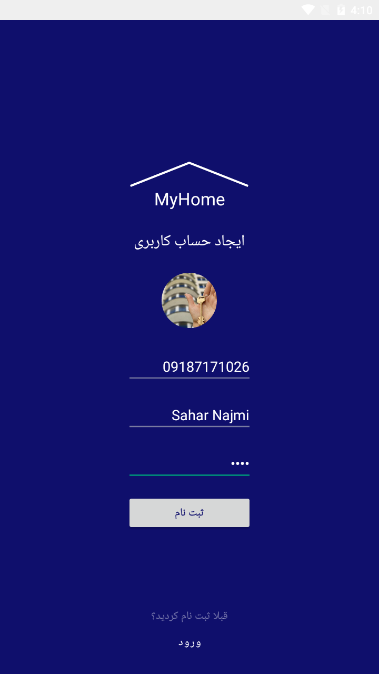
  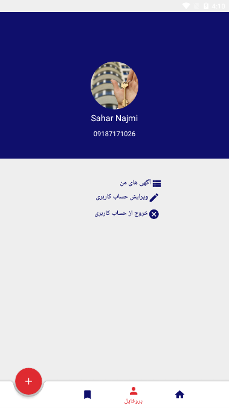

  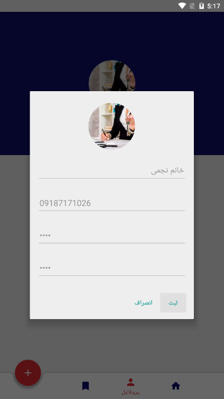
  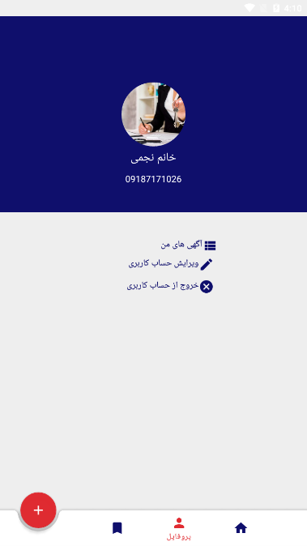
  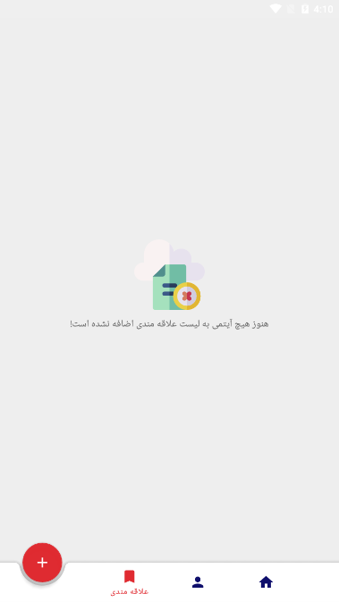

  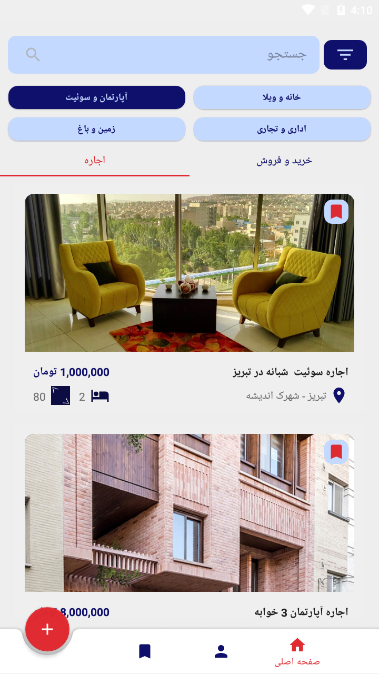
  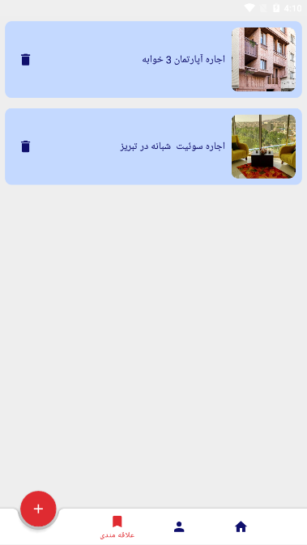
  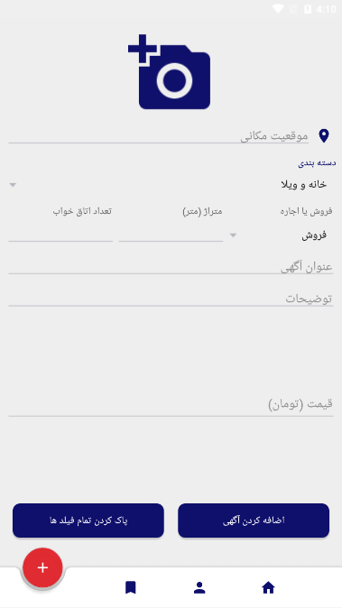

  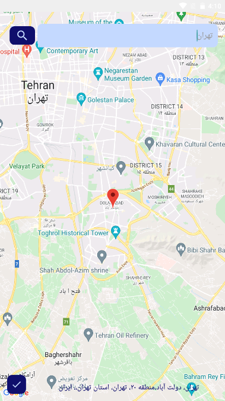
  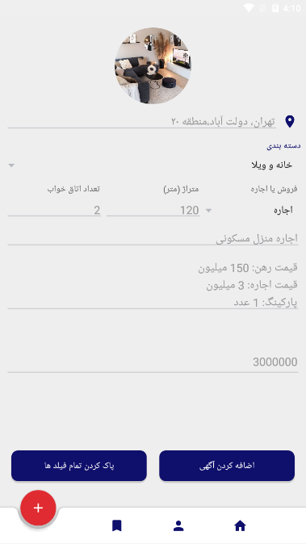
  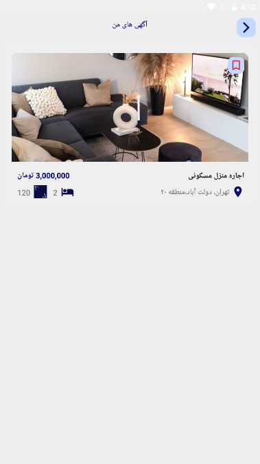

  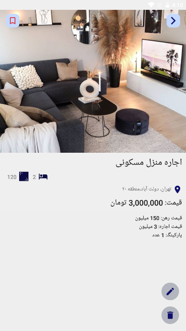
  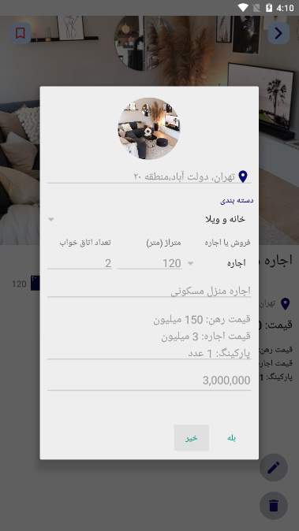

